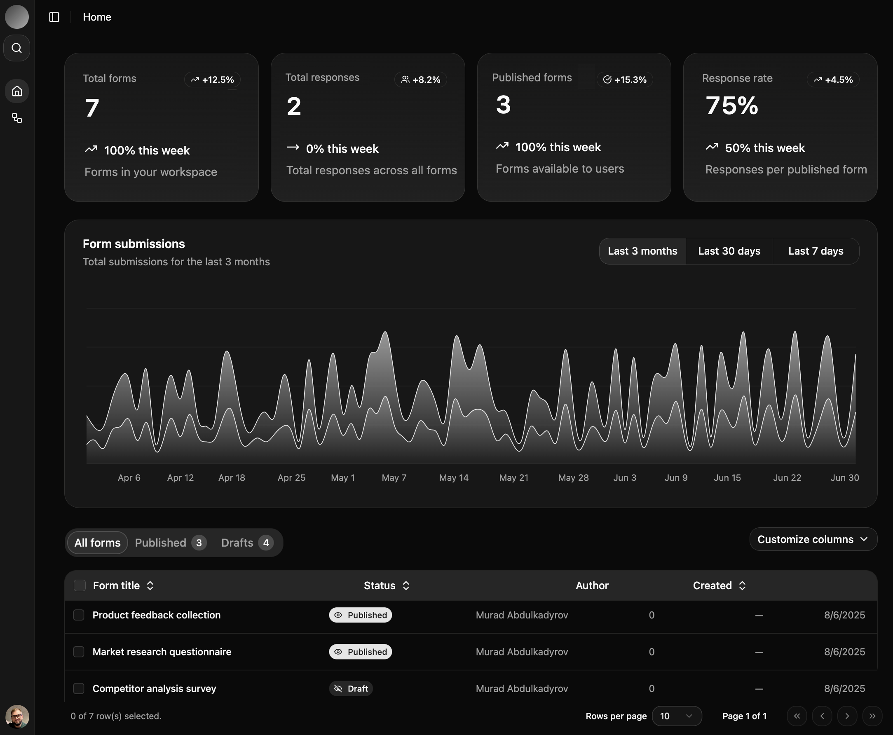

<a href="https://fragmenta.vercel.app">
  
  <h1 align="center">Fragmenta</h1>
</a>

<p align="center">
  Modern Form Builder Built With Next.js, Convex, and AI SDK.
</p>

- Drag-and-drop form builder with live preview and customization
- Supports multiple question types, validation, and conditional logic
- Easy form sharing, embedding, and real-time response collection
- Workspace and team management with roles and permissions
- Secure authentication with OAuth and password protection

<p align="center">
  <a href="#features"><strong>Features</strong></a> ·
  <a href="#model-provider"><strong>Model provider</strong></a> 
  <a href="#deploy-your-own"><strong>Deploy your own</strong></a> ·
  <a href="#running-locally"><strong>Running locally</strong></a>
</p>
<br/>

## Features

- [Next.js](https://nextjs.org) App Router
  - Advanced routing for seamless navigation and performance
  - React Server Components for server-side rendering and increased performance
- [Convex](https://www.convex.dev/)
  - Real-time database for storing form data and responses
  - Backend functions for form logic and processing
- [Convex Auth](https://labs.convex.dev/auth)
  - Simple and secure authentication without external services
  - Built-in support for magic links, OTPs, OAuth, and password authentication
- [AI SDK](https://sdk.vercel.ai/docs)
  - Unified API for generating text, structured objects, and tool calls with LLMs
  - Hooks for building dynamic chat and generative user interfaces
- [Shadcn/ui](https://ui.shadcn.com)
  - Styling with [Tailwind CSS](https://tailwindcss.com)
  - Component primitives from [Radix UI](https://radix-ui.com) for accessibility and flexibility

## Model Providers

This app ships with [Openai](https://openai.com/) provider as the default. However, with the [AI SDK](https://sdk.vercel.ai/docs), you can switch LLM providers to [Ollama](https://ollama.com), [Anthropic](https://anthropic.com), [Cohere](https://cohere.com/), and [many more](https://sdk.vercel.ai/providers/ai-sdk-providers) with just a few lines of code.

## Deploy your own

You can deploy your own version of Fragmenta to Vercel with one click:

[](https://vercel.com/new/clone?repository-url=https%3A%2F%2Fgithub.com%2Fyourusername%2Ffragmenta&env=CONVEX_DEPLOY_KEY,NEXTAUTH_SECRET,NEXTAUTH_URL&envDescription=Learn%20more%20about%20how%20to%20get%20the%20API%20Keys%20for%20the%20application&envLink=https%3A%2F%2Fgithub.com%2Fyourusername%2Ffragmenta%2Fblob%2Fmain%2F.env.example&demo-title=Fragmenta&demo-description=A%20modern%20form%20builder%20application%20built%20with%20Next.js%2C%20Convex%2C%20and%20Tailwind%20CSS.&demo-url=https%3A%2F%2Ffragmenta.vercel.app)

## Running locally

You will need to use the environment variables [defined in `.env.example`](.env.example) to run Fragmenta. It's recommended you use [Vercel Environment Variables](https://vercel.com/docs/projects/environment-variables) for this, but a `.env` file is all that is necessary.

> Note: You should not commit your `.env` file or it will expose secrets that will allow others to control access to your various Convex and authentication provider accounts.

1. Install Vercel CLI: `npm i -g vercel`
2. Link local instance with Vercel and GitHub accounts (creates `.vercel` directory): `vercel link`
3. Download your environment variables: `vercel env pull`

```bash
npm install
npm run dev
```

Your app should now be running on [localhost:3000](http://localhost:3000/).
